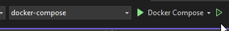
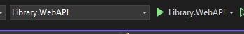
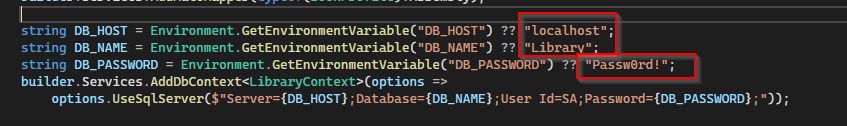
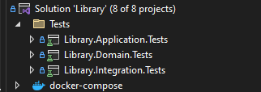

# Library

This project is a web api, coded in C# and .Net 6, with MS SQL Server as database for data persistence. It can be used to manage a collection of Books, with the following attributes.
1. Title
2. ReleaseYear
3. AuthorName
4. Description
5. CoverImage

The API expose 5 endpoints following REST architecture.
- Book GET 
- Book/{id} GET
- Book POST
  - Title (Required, Max Length: 256)
  - Author Name (Required, Max Length: 64 for first name; 512 for surname)
  - Release Year (Required)
  - Description (Optional, Max Length: 8000)
  - CoverImage (Optional)
- Book/{id} PATCH
- Book/{id} DELETE

To more details about the endpoints, the application has OpenAPI specification on 'http://{domain.name}:8000/swagger/index.html'

---

It's recommended running the project using Docker (Docker-Compose needed). You can run the batch file 'InitProject.bat' (Windows only) on '\src\Library'. It'll run the following commands:
- docker-compose up -d 
  - Run the docker-compose.yml in the same folder in detached
- sleep 7
  - Wait 7 seconds for the next command 
- start "" "http://localhost:8000/swagger/index.html"
  - Open your default broswer on Swagger page 

You can also run the project on VS, selecting the docker-compose profile

The project can also be run using the Web.API profile, but you have to create the database Library using SQL Server

and change the connection string variables in Program Class 

---

The tests are divided in three projects, inside the 'Tests' Folder(Visual Studio Solution)

Integration tests need docker to be running, they use the nuget package Testcontainers.MsSql to create a temporary MS SQL Server instance.